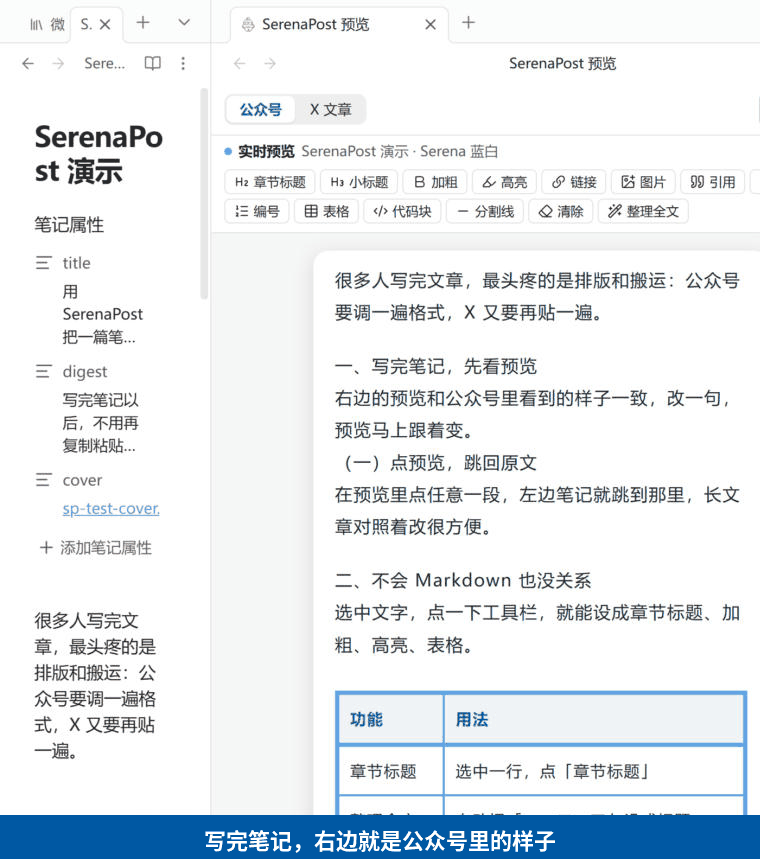
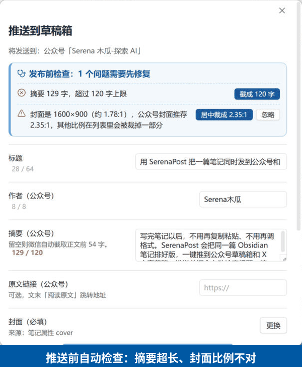
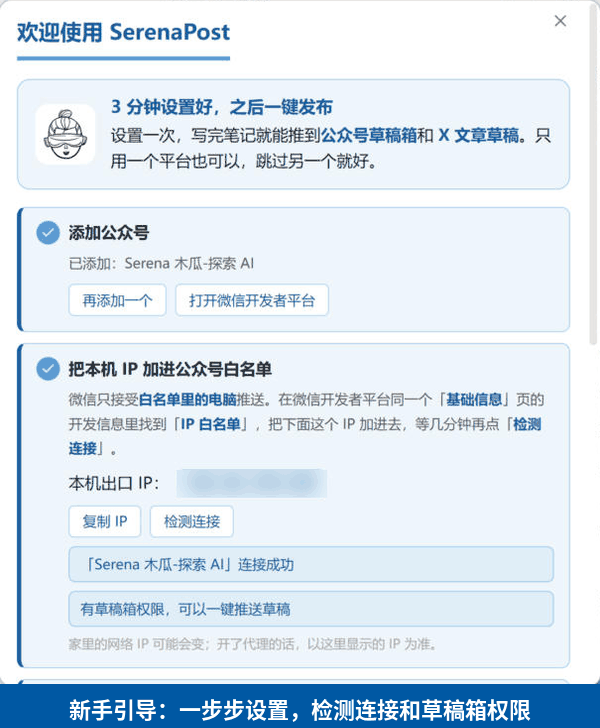
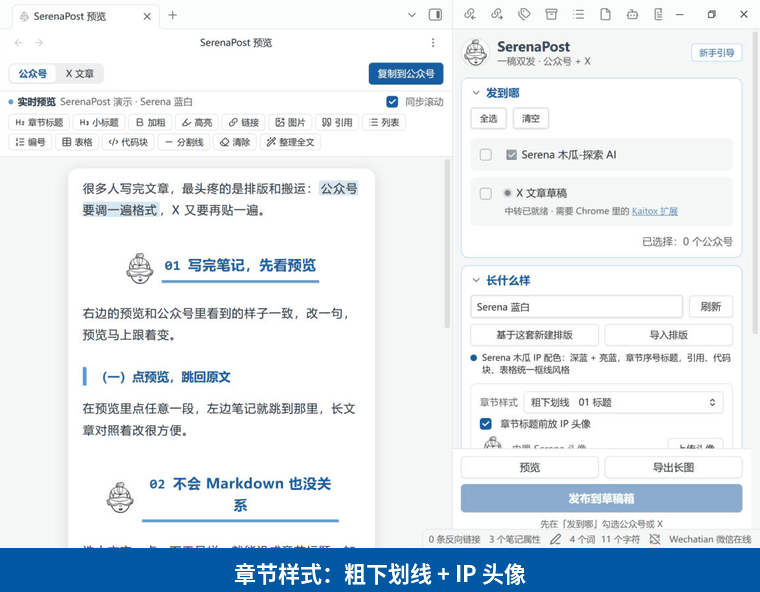

<div align="center">


# SerenaPost

### 一稿双发：在 Obsidian 里写完，一键推到「公众号草稿箱」和「X 文章草稿」

[下载最新版](https://github.com/SerenaMugua/serena-post/releases/latest) · [安装](#安装) · [常见问题](#常见问题) · [更新记录](CHANGELOG.md)

</div>

https://github.com/user-attachments/assets/20107383-c3de-4da1-875f-4deedc727b90

---

## 它能做什么

<p align="center"></p>

| 能力 | 说明 |
| --- | --- |
| 实时预览 | 笔记旁边显示公众号 / X 文章的效果，边写边看；点预览里的段落，笔记跳到那里 |
| 不用学 Markdown | 选中文字点一下：章节标题、加粗、高亮、表格、链接、插入图片；「整理全文」自动把「一、二、三」设成标题 |
| 排版 | 15 套内置排版 + 9 种章节样式，标题前可放你的 IP 头像，文末可加结束标记；也能用可视化编辑器做自己的排版 |
| 推到公众号草稿箱 | 走微信官方接口，正文图片、网络图片、封面自动上传；支持多个公众号 |
| 推到 X 文章草稿 | 配合 Chrome 的 Kaitox 扩展，在你已登录的 X 里自动建好文章草稿 |
| 发布前检查 | 标题 / 摘要超长、封面比例不对、图片问题提前列出来，能一键修的直接修 |
| 记住每篇文章 | 推送后把封面、摘要、排版写回笔记属性，下次推同一篇自动沿用 |

<p align="center"></p>

## 安装

SerenaPost 只支持电脑版 Obsidian（Windows / macOS / Linux），需要 Obsidian 1.11.4 以上。

### 方法一：用 BRAT 安装（推荐，之后能自动更新）

1. Obsidian → 设置 → 第三方插件 → 浏览，搜索 **BRAT**，安装并启用。
2. 设置 → BRAT → **Add Beta plugin**，填入：`SerenaMugua/serena-post`，点 **Add Plugin**。
3. 设置 → 第三方插件，启用 **SerenaPost**。

### 方法二：下载 zip 手动安装

1. 打开 [Releases](https://github.com/SerenaMugua/serena-post/releases/latest)，下载 `serena-post-版本号.zip`。
2. 在 Obsidian 里：设置 → 第三方插件 → 「已安装插件」右边的文件夹图标，会打开 `.obsidian/plugins` 文件夹。
3. 把 zip 解压到这个文件夹里，得到 `plugins/serena-post/`（里面有 `main.js`、`manifest.json`、`styles.css`）。
4. 回到 Obsidian，点「已安装插件」旁的刷新按钮，启用 **SerenaPost**。

> 社区插件市场的上架申请正在进行中，通过后可以直接在「浏览」里搜索 SerenaPost 安装。

### 第一次打开

左侧点 Serena 头像图标打开发布面板，会自动弹出 **新手引导**，跟着做就行：

<p align="center"></p>

1. **添加公众号**：在 [微信开发者平台](https://developers.weixin.qq.com/console/product/mp) →「我的业务与服务 → 公众号 → 基础信息」找到 AppID 和 AppSecret。
2. **IP 白名单**：引导里会显示本机出口 IP，加进同一页开发信息里的「IP 白名单」，再点「检测连接」。检测会顺便告诉你这个号有没有草稿箱权限。
3. **推到 X（可选）**：在 Chrome 应用商店安装 [Kaitox 扩展](https://chromewebstore.google.com/detail/kaitox/ljefnciiojdefgpnphihcijfdmbdomll)，在 Chrome 里登录 X。中转程序已内置，不用装别的。
4. **换上你的 IP（可选）**：上传头像、写一句结束标记。

AppSecret 保存在 Obsidian 的 SecretStorage 里，不会写进插件的 `data.json`。

## 日常使用

1. 打开笔记 → 侧栏点「预览」，右边出现实时预览。
2. 在「长什么样」里选排版、章节样式。
3. 在「发到哪」勾选公众号和 / 或 X，点底部「发布到草稿箱」。
4. 确认弹窗里看一眼「发布前检查」，有问题点按钮修好，再推送。
5. 推送成功后点「打开公众号草稿箱」/「打开 X 草稿」去发布。

<p align="center"></p>

### 笔记属性（可选）

都可以不写，SerenaPost 会自动推断；推送后也会自动写回。

```yaml
title: 文章标题          # 不写用文件名
cover: "[[封面.png]]"    # 不写用正文第一张图
wx_author: Serena木瓜    # 公众号作者（最多 8 个字），不写用设置里的默认作者
digest: 一句话摘要        # 公众号摘要（最多 120 字）
comment: true            # 公众号是否开留言
source_url: https://…    # 公众号「阅读原文」
sp_theme: Serena 蓝白     # 这篇用的排版（推送后自动记录）
sp_heading_style: box    # 这篇用的章节样式（推送后自动记录）
```

## 常见问题

<details>
<summary><b>推送公众号提示「出口 IP 不在白名单」（40164）</b></summary>

微信只接受白名单里的电脑推送。点失败信息下面的「复制 IP」，到 [微信开发者平台](https://developers.weixin.qq.com/console/product/mp) →「公众号 → 基础信息」的开发信息里加进「IP 白名单」，几分钟后点「重新推送」。

家里宽带的 IP 可能会变；开着代理的话，以插件显示的 IP 为准（代理换线路后也要重新加）。
</details>

<details>
<summary><b>提示「没有接口权限」（48001），未认证的个人号能用吗？</b></summary>

未认证的个人号常常没有「草稿箱 / 素材管理」接口权限，不能自动推草稿。这种情况可以用预览顶部的「复制到公众号」，再到公众号编辑器里粘贴，排版会保留。新手引导里的「检测连接」会提前告诉你有没有这个权限。
</details>

<details>
<summary><b>提示 AppSecret 无效（40125 / 40001）</b></summary>

到微信开发者平台重置 AppSecret，然后点失败信息下面的「编辑账号」重新填写。
</details>

<details>
<summary><b>X 推送失败：「中转程序没有运行」</b></summary>

点失败信息下面的「启动内置中转」即可；或到 设置 → SerenaPost → X 推送，打开「内置中转」。如果你以前装过 Kaitox 的命令行中转，SerenaPost 会自动复用它，也可以点「接管旧的 Kaitox 中转」。
</details>

<details>
<summary><b>X 推送成功了，但 X 里没看到草稿</b></summary>

确认三件事：Chrome 里装了 [Kaitox 扩展](https://chromewebstore.google.com/detail/kaitox/ljefnciiojdefgpnphihcijfdmbdomll) 并且是开启状态；Chrome 里登录了 X；推送后打开的 X 文章编辑器页面不要马上关掉，扩展需要几秒钟创建草稿。
</details>

<details>
<summary><b>每次启动都弹「本地 relay 未运行」</b></summary>

这是旧的 Kaitox Obsidian 插件发出的提示。SerenaPost 已经内置了它的功能，侧栏顶部会提示「可以关掉旧 Kaitox 插件」，点「一键关闭」就好（Chrome 里的 Kaitox 扩展要保留）。
</details>

<details>
<summary><b>公众号草稿里缺图 / 动图不动了</b></summary>

- 公众号接口只接受 JPG / PNG、1MB 以内的图片：SerenaPost 会自动压缩，WebP 自动转 JPG。
- GIF 动图会变成第一帧的静态图，想保留动图需要在公众号编辑器里重新插入。
- 网络图片会自动下载再上传；如果原网站不允许下载，这张图会缺失。
- 发布前检查会提前列出这些情况。
</details>

<details>
<summary><b>封面被裁掉了一部分</b></summary>

公众号封面推荐比例是 2.35:1。比例不对时，发布前检查里点「居中裁成 2.35:1」即可，裁好的封面会存进库里，下次自动沿用。
</details>

<details>
<summary><b>更新插件后看不到变化</b></summary>

Obsidian 需要重新加载插件：按 `Ctrl/Cmd + P`，输入「重新加载」并回车；或者重启 Obsidian。用 BRAT 安装的会自动检查更新。
</details>

<details>
<summary><b>不想让插件改我的笔记属性</b></summary>

设置 → SerenaPost → 关闭「推送后记住这篇文章的设置」。
</details>

## 隐私与网络

SerenaPost 会访问这些网络地址，只用于你主动触发的功能：

- `api.weixin.qq.com`：获取 Access Token、上传图片、创建公众号草稿。
- `api.ipify.org`：检测本机出口 IP，方便你填白名单。
- 正文里的网络图片地址：推送公众号时下载再上传。
- `127.0.0.1:8765`：内置的本地中转，只在本机监听，供 Chrome 的 Kaitox 扩展读取 X 草稿。

SerenaPost 会在库外读写 `~/.kaitox` 文件夹（和 Kaitox 共用，存放待推送的 X 草稿）。不收集任何统计数据，不上传你的笔记到除微信 / X 以外的任何地方。

## 本地构建

```bash
npm install
npm run build
```

发布新版本：改好 `CHANGELOG.md`，运行 `npm version 1.2.0`，再推送代码和同名标签（不带 v），GitHub Actions 会自动构建并创建 Release。

## 致谢与许可

SerenaPost 基于两个 MIT 开源项目修改而来，感谢原作者：

- [WeChatPB](https://github.com/Kianzzz/wechatPB)（zhouxing）—— 公众号排版、多账号与草稿发布
- [Kaitox](https://github.com/kuangjiajia/kaitox-toolkit)（kaitox）—— X 文章预览、格式检查、中转协议与 Chrome 扩展
- 章节样式参考了 [Punk 微排](https://weipai.iamadrianpunk.com/) 的设计

代码以 [MIT](LICENSE) 许可发布，第三方许可全文见 [THIRD_PARTY_NOTICES.md](THIRD_PARTY_NOTICES.md)。
Serena 木瓜 IP 头像版权归作者所有，不在 MIT 许可范围内。
